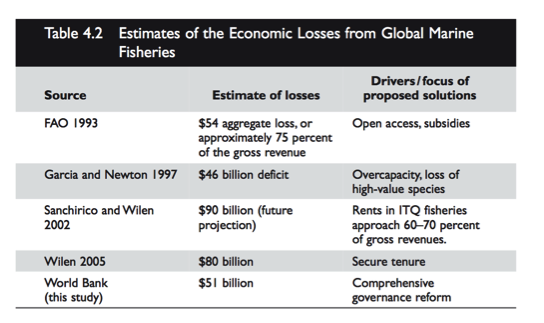

```{r setup, include=FALSE}
knitr::opts_chunk$set(echo = TRUE)
```

```{r, include = FALSE }

suppressPackageStartupMessages({
  library(tidyverse)
  library(tidyr)
  library(here)
  library(ggplot2)
  library(dplyr)
  library(readxl)
  library(devtools)
  library(plotly)
  library(base)
  library(rio)
  library(knitr)
  library(doBy)
})
```


##KOBE Plots with only most recent year of fisheries
###RAM only
No data: ITQ = FALSE

```{r message=FALSE}

#read in data: this is updated projection data (updated using RAMs) and Corbett's ITQ/Turf data applied to each fishery. only data for most recent year for each fishery is represented.

fisheries_recent <- read_csv("data/fisheries_recent.csv")

#assuming that when no data is avaliable on the fishery inregardes to ITQ or Turfs that means there are none
fisheries_recent$itq[is.na(fisheries_recent$itq)] <- "FALSE"
fisheries_recent$ivq[is.na(fisheries_recent$ivq)] <- "FALSE"
fisheries_recent$iq[is.na(fisheries_recent$iq)] <- "FALSE"
fisheries_recent$turf[is.na(fisheries_recent$turf)] <- "FALSE"

a = fisheries_recent %>% 
  filter(Dbase == "RAM") %>% 
  ggplot(aes(BvBmsy, FvFmsy, color =Dbase )) + 
  geom_point() + 
  coord_cartesian(xlim = c(0,4), ylim = c(0,4))

b = fisheries_recent %>% 
  ggplot(aes(BvBmsy, FvFmsy, color =Dbase )) + 
  geom_point() + 
  coord_cartesian(xlim = c(0,4), ylim = c(0,4))


#timeseries_values_views%>% 
#  filter(year == 2016) %>% 
#  select(BdivBmsypref,UdivUmsypref) %>% 
#  na.omit() %>% 
#  nrow()  
#  ggplot(aes(BdivBmsypref,UdivUmsypref)) + 
#  geom_point()
  
a
  
b
  

#median F and B values
dbase_median <- fisheries_recent %>% 
  select(BvBmsy,FvFmsy, Dbase) %>%
    group_by(Dbase) %>%
    na.omit() %>%
    summarise_each(funs(median)) %>% 
    ggplot()+
    geom_point(aes(x=BvBmsy, y=FvFmsy, colour=Dbase))


fisheries_median <-fisheries_recent %>% 
  select(BvBmsy,FvFmsy) %>%
    na.omit() %>%
    summarise_each(funs(median)) %>% 
    ggplot()+
    geom_point(aes(x=BvBmsy, y=FvFmsy))

  
```


```{r}

#only looking at fisheries data that come from RAMS database
# creating new column called "rightsbased" where 1 = ITQ and 0 = No ITQ
fisheries_KOBE_ram <- fisheries_recent %>%
  filter(Dbase == "RAM") %>%
  mutate(rightsbased = case_when(
    itq == TRUE | iq == TRUE | ivq == TRUE ~ "1",
    itq == FALSE & iq == FALSE & ivq == FALSE ~ "0")) 

#graphing 
fisheries_KOBE_ram$rightsbased[fisheries_KOBE_ram$rightsbased == "0"]<- "No ITQ"
fisheries_KOBE_ram$rightsbased[fisheries_KOBE_ram$rightsbased == "1"]<- "ITQ"

F_B_graph_ram <- ggplot(data = fisheries_KOBE_ram, aes( x=BvBmsy, y=FvFmsy, colour= rightsbased, size = Catch ))+
  geom_point()+
  labs(x = "B/Bmsy", y= "F/Fsmy") +
  theme_minimal()+
  theme(legend.title=element_blank())+
  ylim(0, 2.5)+
  xlim(0, 2.5)+
  geom_hline(aes(yintercept=1))+
  geom_vline(aes(xintercept=1))+
  ggtitle("KOBE Plot:  RAM Fisheries")

F_B_graph_ram

```


##KOBE Plots with only most recent year of fisheries
###All Data Sources
No data: ITQ = FALSE
```{r}

fisheries_KOBE <- fisheries_recent %>%
  mutate(rightsbased = case_when(
    itq == TRUE | iq == TRUE | ivq == TRUE ~ "1",
    itq == FALSE & iq == FALSE & ivq == FALSE ~ "0")) 

fisheries_KOBE$rightsbased[fisheries_KOBE$rightsbased == "0"]<- "No ITQ"
fisheries_KOBE$rightsbased[fisheries_KOBE$rightsbased == "1"]<- "ITQ"

#graphing 
F_B_graph <- ggplot(data = fisheries_KOBE, aes( x=BvBmsy, y=FvFmsy, colour= rightsbased, size = Catch ))+
  geom_point()+
  labs(x = "B/Bmsy", y= "F/Fsmy") +
  theme_minimal()+
  theme(legend.title=element_blank())+
  ylim(0, 2.5)+
  xlim(0, 2.5)+
  geom_hline(aes(yintercept=1))+
  geom_vline(aes(xintercept=1))+
  ggtitle("KOBE Plot:  All Fisheries")

F_B_graph

itq_median <- fisheries_KOBE %>% 
  select(BvBmsy,FvFmsy, rightsbased) %>%
  group_by(rightsbased) %>%
    na.omit() %>%
    summarise_each(funs(median)) %>% 
    ggplot()+
    geom_point(aes(x=BvBmsy, y=FvFmsy, colour = rightsbased))+
  ggtitle("Medians for ITQ and non ITQ fisheries")
itq_median

```


##Total Catch: Most recent year for each fishery 
```{r}

fisheries_recent <- read_csv("data/fisheries_recent.csv")

#assuming that when no data is present for itqs/turf that means there are none
fisheries_recent$turf[is.na(fisheries_recent$turf)] <- "FALSE"
fisheries_recent$itq[is.na(fisheries_recent$itq)] <- "FALSE"
fisheries_recent$ivq[is.na(fisheries_recent$ivq)] <- "FALSE"
fisheries_recent$iq[is.na(fisheries_recent$iq)] <- "FALSE"

fisheries_turf_itqs <- fisheries_recent %>%
  mutate(rightsbased = case_when(
    turf == TRUE ~ "2",
    itq == TRUE | iq == TRUE | ivq == TRUE ~ "1",
    itq == FALSE & iq == FALSE & ivq == FALSE ~ "0"
    ))

turfs_catch <- filter(fisheries_turf_itqs, rightsbased == "2")
itq_catch <- filter(fisheries_turf_itqs, rightsbased == "1")
no_itq_catch <- filter(fisheries_turf_itqs, rightsbased == "0")

sum(turfs_catch$Catch, na.rm = TRUE)

sum(itq_catch$Catch, na.rm = TRUE)

sum(no_itq_catch$Catch, na.rm = TRUE)

```

turf = 234000 = 0.29% of total catch
itq = 4093520 = 5.1% of total catch

Global Catch Estimate = 80 million

##Percent Catch ITQ over last 5 Years

```{r}
# by assess id
fisheries_recent_5years <- read_csv("data/fisheries_recent_5years.csv")

#assuming that when no data is present for itqs/turf that means there are none
fisheries_recent_5years$turf[is.na(fisheries_recent_5years$turf)] <- "FALSE"
fisheries_recent_5years$itq[is.na(fisheries_recent_5years$itq)] <- "FALSE"
fisheries_recent_5years$ivq[is.na(fisheries_recent_5years$ivq)] <- "FALSE"
fisheries_recent_5years$iq[is.na(fisheries_recent_5years$iq)] <- "FALSE"


###creating new column for management; also merging country and the name of species in order to have a way of IDing the fishery to merge with averages in next code peiece
fisheries_turf_itqs_5years_1 <- fisheries_recent_5years %>%
  mutate(rightsbased = case_when(
    turf == TRUE ~ "2",
    itq == TRUE | iq == TRUE | ivq == TRUE ~ "1",
    itq == FALSE & iq == FALSE & ivq == FALSE ~ "0"
    ))

##get average catch over last 5 years for each fishery
mean_5years <- aggregate(fisheries_turf_itqs_5years_1[, 7], list(fisheries_turf_itqs_5years_1$assess_id_short), mean)

colnames(mean_5years) <- c("assess_id_short", "FiveYearCatchAvg")

fisheries_turf_itqs_5years_2 <- select(fisheries_turf_itqs_5years_1, "assess_id_short", "rightsbased", "CommName")

fisheries_turf_itqs_5years <-  merge(fisheries_turf_itqs_5years_2, mean_5years, by.x = "assess_id_short")

turfs_catch <- filter(fisheries_turf_itqs_5years, rightsbased == "2")
itq_catch <- filter(fisheries_turf_itqs_5years, rightsbased == "1")
no_itq_catch <- filter(fisheries_turf_itqs_5years, rightsbased == "0")

sum(turfs_catch$FiveYearCatchAvg, na.rm = TRUE)

sum(itq_catch$FiveYearCatchAvg, na.rm = TRUE)

sum(no_itq_catch$FiveYearCatchAvg, na.rm = TRUE)

###########
#by common name
# end up with same number by common name becuase the fisheries without more infor (just common name, and location don't have ITQs)

fisheries_recent_5years <- read_csv("data/fisheries_recent_5years.csv")

#assuming that when no data is present for itqs/turf that means there are none
fisheries_recent_5years$turf[is.na(fisheries_recent_5years$turf)] <- "FALSE"
fisheries_recent_5years$itq[is.na(fisheries_recent_5years$itq)] <- "FALSE"
fisheries_recent_5years$ivq[is.na(fisheries_recent_5years$ivq)] <- "FALSE"
fisheries_recent_5years$iq[is.na(fisheries_recent_5years$iq)] <- "FALSE"


###creating new column for management; also merging country and the name of species in order to have a way of IDing the fishery to merge with averages in next code peiece
fisheries_turf_itqs_5years_1 <- fisheries_recent_5years %>%
  mutate(rightsbased = case_when(
    turf == TRUE ~ "2",
    itq == TRUE | iq == TRUE | ivq == TRUE ~ "1",
    itq == FALSE & iq == FALSE & ivq == FALSE ~ "0"
    ))

##get average catch over last 5 years for each fishery
mean_5years <- aggregate(fisheries_turf_itqs_5years_1[, 9], list(fisheries_turf_itqs_5years_1$CommName), mean)

colnames(mean_5years) <- c("CommName", "FiveYearCatchAvg")

fisheries_turf_itqs_5years_2 <- select(fisheries_turf_itqs_5years_1, "assess_id_short", "rightsbased", "CommName")

fisheries_turf_itqs_5years <-  merge(fisheries_turf_itqs_5years_2, mean_5years, by.x = "CommName")

turfs_catch <- filter(fisheries_turf_itqs_5years, rightsbased == "2")
itq_catch <- filter(fisheries_turf_itqs_5years, rightsbased == "1")
no_itq_catch <- filter(fisheries_turf_itqs_5years, rightsbased == "0")

sum(turfs_catch$FiveYearCatchAvg, na.rm = TRUE)

sum(itq_catch$FiveYearCatchAvg, na.rm = TRUE)

sum(no_itq_catch$FiveYearCatchAvg, na.rm = TRUE)

```
Turf: 234,000
ITQ: 4,093,520 = 5.1%
3,200,000 peru anchovies


##Percent Catch ITQ over last 10 Years
```{r}

fisheries_recent_10years <- read_csv("data/fisheries_recent_10years.csv")

#assuming that when no data is present for itqs/turf that means there are none
fisheries_recent_10years$turf[is.na(fisheries_recent_10years$turf)] <- "FALSE"
fisheries_recent_10years$itq[is.na(fisheries_recent_10years$itq)] <- "FALSE"
fisheries_recent_10years$ivq[is.na(fisheries_recent_10years$ivq)] <- "FALSE"
fisheries_recent_10years$iq[is.na(fisheries_recent_10years$iq)] <- "FALSE"


###creating new column for management; also merging country and the name of species in order to have a way of IDing the fishery to merge with averages in next code peiece
fisheries_turf_itqs_10years_1 <- fisheries_recent_10years %>%
  mutate(rightsbased = case_when(
    turf == TRUE ~ "2",
    itq == TRUE | iq == TRUE | ivq == TRUE ~ "1",
    itq == FALSE & iq == FALSE & ivq == FALSE ~ "0"
    )) 

##get average catch over last 5 years for each fishery
mean_10years <- aggregate(fisheries_turf_itqs_10years_1[, 7], list(fisheries_turf_itqs_10years_1$assess_id_short), mean)
colnames(mean_10years) <- c("assess_id_short", "TenYearCatchAvg")

fisheries_turf_itqs_10years_2 <- select(fisheries_turf_itqs_10years_1, "assess_id_short", "rightsbased", "CommName")

fisheries_turf_itqs_10years <-  merge(fisheries_turf_itqs_10years_2, mean_10years, by.x = "assess_id_short")

turfs_catch <- filter(fisheries_turf_itqs_10years, rightsbased == "2")
itq_catch <- filter(fisheries_turf_itqs_10years, rightsbased == "1")
no_itq_catch <- filter(fisheries_turf_itqs_10years, rightsbased == "0")

sum(turfs_catch$TenYearCatchAvg, na.rm = TRUE)

sum(itq_catch$TenYearCatchAvg, na.rm = TRUE)

sum(no_itq_catch$TenYearCatchAvg, na.rm = TRUE)

##by common name instead of assess_id ; get same numbers
##get average catch over last 5 years for each fishery
mean_10years <- aggregate(fisheries_turf_itqs_10years_1[, 7], list(fisheries_turf_itqs_10years_1$CommName), mean)
colnames(mean_10years) <- c("CommName", "TenYearCatchAvg")

fisheries_turf_itqs_10years_2 <- select(fisheries_turf_itqs_10years_1, "assess_id_short", "rightsbased", "CommName")

fisheries_turf_itqs_10years <-  merge(fisheries_turf_itqs_10years_2, mean_10years, by.x = "CommName")

turfs_catch <- filter(fisheries_turf_itqs_10years, rightsbased == "2")
itq_catch <- filter(fisheries_turf_itqs_10years, rightsbased == "1")
no_itq_catch <- filter(fisheries_turf_itqs_10years, rightsbased == "0")

sum(turfs_catch$TenYearCatchAvg, na.rm = TRUE)

sum(itq_catch$TenYearCatchAvg, na.rm = TRUE)

sum(no_itq_catch$TenYearCatchAvg, na.rm = TRUE)
```
Turf: 234,000
ITQ: 4,115,210 = 5.1%


## Total Catch: A more generous estimation of Turf catch

```{r message =FALSE}

#load data with info only on most recent year for each fishery (includes upside, updated with RAMs, corbette itq/turf data)
fisheries_recent <- read_csv("data/fisheries_recent.csv")

#turf data from edf and discover turfs
turfs_edf_dt <- read_csv("data/turfs_edf_dt.csv")
```

```{r}

fisheries_recent_generousturf_1 <- select(fisheries_recent, Country, assess_id_short, Year,SciName, Catch, itq, ivq, iq)

#merge the most recent data on each fishery with turf data
fisheries_recent_generousturf <- merge(fisheries_recent_generousturf_1, turfs_edf_dt, by = c("Country", "SciName") , all.x = "TRUE")

#assuming that when no data is present for itqs/turf that means there are none
fisheries_recent_generousturf$turf[is.na(fisheries_recent_generousturf$turf)] <- "FALSE"
fisheries_recent_generousturf$itq[is.na(fisheries_recent_generousturf$itq)] <- "FALSE"
fisheries_recent_generousturf$ivq[is.na(fisheries_recent_generousturf$ivq)] <- "FALSE"
fisheries_recent_generousturf$iq[is.na(fisheries_recent_generousturf$iq)] <- "FALSE"

fisheries_recent_generousturf_rightsbased <- fisheries_recent_generousturf %>%
  mutate(rightsbased = case_when(
    turf == TRUE ~ "2",
    itq == FALSE & iq == FALSE & ivq == FALSE ~ "0",
    itq == TRUE | iq == TRUE | ivq == TRUE ~ "1"
    ))

#create dfs for turf, itq, and no itq fisheries to calculate the sum of each
#NOTE to rememeber: the data from these fisheries are the most recent numbers we have. they are not all in the same year 

turfs_generous <- filter(fisheries_recent_generousturf_rightsbased, rightsbased == "2")
itq_generous <- filter(fisheries_recent_generousturf_rightsbased, rightsbased == "1")
no_itq_generous <- filter(fisheries_recent_generousturf_rightsbased, rightsbased == "0")

sum(turfs_generous$Catch, na.rm = TRUE)

sum(itq_generous$Catch, na.rm = TRUE)

sum(no_itq_generous$Catch, na.rm = TRUE)

```


Generous Turf Catch Estimates:

turf = 1246549 -> 1.5% global catch
itq= 4093520 -> 5.1% global catch

Global Estimate = 80,000,000

##Logit regressions

- new UN GDP data, 2016 only
- Scaled GDPs

###Probablity of itq = f(ISSCAPP and GDP)

```{r}

fisheries_recent$itq[is.na(fisheries_recent$itq)] <- "FALSE"
fisheries_recent$ivq[is.na(fisheries_recent$ivq)] <- "FALSE"
fisheries_recent$iq[is.na(fisheries_recent$iq)] <- "FALSE"
fisheries_recent$turf[is.na(fisheries_recent$turf)] <- "FALSE"

fisheries_recent_generousturf_1 <- fisheries_recent %>%
  select(Country, assess_id_short, Year, CommName, Biomass, Catch, BvBmsy, FvFmsy, Dbase, SciName, IdLevel, SpeciesCat.x, Profits, MSY, Price, g, k, c, phi, itq, ivq, iq)

colnames(fisheries_recent_generousturf_1) <- c("Country", "assess_id_short", "Year", "CommName", "Biomass", "Catch", "BvBmsy", "FvFmsy", "Dbase", "SciName", "IdLevel", "SpeciesCat", "Profits", "MSY", "Price", "g", "k", "c", "phi", "itq", "ivq", "iq")
fisheries_recent_generousturf <- merge(fisheries_recent_generousturf_1, turfs_edf_dt, by = c("Country", "SciName") , all.x = "TRUE")

fisheries_recent_generousturf$turf[is.na(fisheries_recent_generousturf$turf)] <- "FALSE"
fisheries_recent_generousturf$itq[is.na(fisheries_recent_generousturf$itq)] <- "FALSE"
fisheries_recent_generousturf$ivq[is.na(fisheries_recent_generousturf$ivq)] <- "FALSE"
fisheries_recent_generousturf$iq[is.na(fisheries_recent_generousturf$iq)] <- "FALSE"

fisheries_recent_generousturf_rightsbased <- fisheries_recent_generousturf %>%
  mutate(rightsbased = case_when(
    itq == TRUE | iq == TRUE | ivq == TRUE ~ "1",
    itq == FALSE | iq == FALSE | ivq == FALSE ~ "0"
    ))

gdp_all <- read_excel("data/un_gdp_2016.xls")

gdp <- gdp_all %>%
  select(Country, gdp_center) %>%
  filter( gdp_center != "NA") 

merge_gdp_rightsbased <- merge(gdp, fisheries_recent_generousturf_rightsbased, by = c("Country"))

gdp_rightsbased <- filter(merge_gdp_rightsbased, SpeciesCat != "NA" )

gdp_rightsbased$SpeciesCat <- factor(gdp_rightsbased$SpeciesCat)
gdp_rightsbased$rightsbased <- as.numeric(gdp_rightsbased$rightsbased)
                              

itq_glm <- glm(formula = rightsbased ~ gdp_center + SpeciesCat, family = "binomial", data = gdp_rightsbased)
itq_glm

summary(itq_glm)
```

**The intercepts for the species categories are not coming up as significant at all. Recategorized fish according to the next level up for the ISSCAAP codes. Reclassifications are below: **

Larger Categories for ISSCAAP Codes
22-24 = diadromous fishes = 2
31-35, 37 = marine fishes = 3
42-45,47 = crustaceans = 4
52-58 = molluscs = 5
74,76,77 = miscellaneous aquatic animals = 7

###Rerun Logits with higher up species categories
```{r}

fisheries_recent <- read_csv("data/fisheries_recent.csv")

fisheries_recent$itq[is.na(fisheries_recent$itq)] <- "FALSE"
fisheries_recent$ivq[is.na(fisheries_recent$ivq)] <- "FALSE"
fisheries_recent$iq[is.na(fisheries_recent$iq)] <- "FALSE"
fisheries_recent$turf[is.na(fisheries_recent$turf)] <- "FALSE"

turf_itq_isscaap <- read_csv("data/turf_itq_isscaap.csv")

fisheries_recent_generousturf_1 <- fisheries_recent %>%
  select(Country, assess_id_short, Year, CommName, Biomass, Catch, BvBmsy, FvFmsy, Dbase, SciName, IdLevel, SpeciesCat.x, Profits, MSY, Price, g, k, c, phi, itq, ivq, iq)

colnames(fisheries_recent_generousturf_1) <- c("Country", "assess_id_short", "Year", "CommName", "Biomass", "Catch", "BvBmsy", "FvFmsy", "Dbase", "SciName", "IdLevel", "SpeciesCat", "Profits", "MSY", "Price", "g", "k", "c", "phi", "itq", "ivq", "iq")

fisheries_recent_generousturf <- merge(fisheries_recent_generousturf_1, turfs_edf_dt, by = c("Country", "SciName") , all.x = "TRUE")

fisheries_recent_generousturf$turf[is.na(fisheries_recent_generousturf$turf)] <- "FALSE"
fisheries_recent_generousturf$itq[is.na(fisheries_recent_generousturf$itq)] <- "FALSE"
fisheries_recent_generousturf$ivq[is.na(fisheries_recent_generousturf$ivq)] <- "FALSE"
fisheries_recent_generousturf$iq[is.na(fisheries_recent_generousturf$iq)] <- "FALSE"

fisheries_recent_regression_1 <- fisheries_recent_generousturf %>%
  mutate(rightsbased = case_when(
    itq == TRUE | iq == TRUE | ivq == TRUE ~ "1",
    itq == FALSE | iq == FALSE | ivq == FALSE ~ "0"
    )) %>%
  mutate(MainCat = case_when(
    SpeciesCat == 22 | SpeciesCat == 23 | SpeciesCat == 24 ~ "2",
    SpeciesCat == 31 | SpeciesCat == 32 | SpeciesCat == 33 | SpeciesCat == 34 | SpeciesCat     == 35 | SpeciesCat == 37 ~ "3",
    SpeciesCat == 42 | SpeciesCat == 43 | SpeciesCat == 44 | SpeciesCat == 45 | SpeciesCat      == 47 ~ "4",
    SpeciesCat == 52 | SpeciesCat == 53 | SpeciesCat ==54 |  SpeciesCat == 55 | SpeciesCat     == 56 | SpeciesCat == 57 | SpeciesCat == 58 ~ "5",
    SpeciesCat == 74 | SpeciesCat == 76 | SpeciesCat == 77 ~ "7"
  )) %>%
  select(Country, SciName, MainCat, rightsbased) %>%
  filter(MainCat != "NA")


gdp_all <- read_excel("data/un_gdp_2016.xls")

gdp <- gdp_all %>%
  select(Country, gdp_center) %>%
  filter( gdp_center != "NA") 


merge_gdp_mc_rb <- merge(gdp, fisheries_recent_regression_1, by = c("Country"))

gdp_mc_rb <- filter(merge_gdp_mc_rb, MainCat != "NA" )

gdp_mc_rb$MainCat <- factor(gdp_mc_rb$MainCat)
gdp_mc_rb$rightsbased <- as.numeric(gdp_mc_rb$rightsbased)
                              

itq_glm_mc <- glm(formula = rightsbased ~ gdp_center + MainCat, family = "binomial", data = gdp_mc_rb)

itq_glm_mc

summary(itq_glm_mc)

```
Larger categories do not seem to make a difference

###Run Turf versus ITQ probably: prob(ITQ). Turf = 1 and ITQ = 0 with the data set that was the turf/itq only one
```{r}

fisheries_recent <- read_csv("data/fisheries_recent.csv")

fisheries_recent$itq[is.na(fisheries_recent$itq)] <- "FALSE"
fisheries_recent$ivq[is.na(fisheries_recent$ivq)] <- "FALSE"
fisheries_recent$iq[is.na(fisheries_recent$iq)] <- "FALSE"
fisheries_recent$turf[is.na(fisheries_recent$turf)] <- "FALSE"

fisheries_recent_generousturf_1 <- fisheries_recent %>%
  select(Country, assess_id_short, Year, CommName, Biomass, Catch, BvBmsy, FvFmsy, Dbase, SciName, IdLevel, SpeciesCat.x, Profits, MSY, Price, g, k, c, phi, itq, ivq, iq)

colnames(fisheries_recent_generousturf_1) <- c("Country", "assess_id_short", "Year", "CommName", "Biomass", "Catch", "BvBmsy", "FvFmsy", "Dbase", "SciName", "IdLevel", "SpeciesCat", "Profits", "MSY", "Price", "g", "k", "c", "phi", "itq", "ivq", "iq")

fisheries_recent_generousturf <- merge(fisheries_recent_generousturf_1, turfs_edf_dt, by = c("Country", "SciName") , all.x = "TRUE")

fisheries_recent_generousturf$turf[is.na(fisheries_recent_generousturf$turf)] <- "FALSE"
fisheries_recent_generousturf$itq[is.na(fisheries_recent_generousturf$itq)] <- "FALSE"
fisheries_recent_generousturf$ivq[is.na(fisheries_recent_generousturf$ivq)] <- "FALSE"
fisheries_recent_generousturf$iq[is.na(fisheries_recent_generousturf$iq)] <- "FALSE"

fisheries_recent_generousturf_rightsbased <- fisheries_recent_generousturf %>%
  mutate(rightsbased = case_when(
    turf == TRUE ~ "1",
    itq == TRUE | iq == TRUE | ivq == TRUE ~ "0"
    ))

gdp_all <- read_excel("data/un_gdp_2016.xls")

gdp <- gdp_all %>%
  select(Country, gdp_center) %>%
  filter( gdp_center != "NA") 

join_gdp_rightsbased <- merge(gdp, fisheries_recent_generousturf_rightsbased, by = c("Country"))

gdp_rightsbased <- filter(join_gdp_rightsbased, SpeciesCat != "NA" )

gdp_rightsbased$SpeciesCat <- factor(gdp_rightsbased$SpeciesCat)
gdp_rightsbased$rightsbased <- as.numeric(gdp_rightsbased$rightsbased)
                              

itq_turf_glm <- glm(formula = rightsbased ~ gdp_center + SpeciesCat, family = "binomial", data = gdp_rightsbased)
itq_glm

summary(itq_turf_glm)

```

**The intercepts for the species categories are not coming up as significant at all. Recategorized fish according to the next level up for the ISSCAAP codes. Reclassifications are below: **

Larger Categories for ISSCAAP Codes
22-24 = diadromous fishes = 2
31-35, 37 = marine fishes = 3
42-45,47 = crustaceans = 4
52-58 = molluscs = 5
74,76,77 = miscellaneous aquatic animals = 7

###Rerun Logits with higher up species categories

```{r}
fisheries_recent <- read_csv("data/fisheries_recent.csv")

fisheries_recent$itq[is.na(fisheries_recent$itq)] <- "FALSE"
fisheries_recent$ivq[is.na(fisheries_recent$ivq)] <- "FALSE"
fisheries_recent$iq[is.na(fisheries_recent$iq)] <- "FALSE"
fisheries_recent$turf[is.na(fisheries_recent$turf)] <- "FALSE"

turf_itq_isscaap <- read_csv("data/turf_itq_isscaap.csv")

fisheries_recent_generousturf_1 <- fisheries_recent %>%
  select(Country, assess_id_short, Year, CommName, Biomass, Catch, BvBmsy, FvFmsy, Dbase, SciName, IdLevel, SpeciesCat.x, Profits, MSY, Price, g, k, c, phi, itq, ivq, iq)

colnames(fisheries_recent_generousturf_1) <- c("Country", "assess_id_short", "Year", "CommName", "Biomass", "Catch", "BvBmsy", "FvFmsy", "Dbase", "SciName", "IdLevel", "SpeciesCat", "Profits", "MSY", "Price", "g", "k", "c", "phi", "itq", "ivq", "iq")

fisheries_recent_generousturf <- merge(fisheries_recent_generousturf_1, turfs_edf_dt, by = c("Country", "SciName") , all.x = "TRUE")

fisheries_recent_generousturf$turf[is.na(fisheries_recent_generousturf$turf)] <- "FALSE"
fisheries_recent_generousturf$itq[is.na(fisheries_recent_generousturf$itq)] <- "FALSE"
fisheries_recent_generousturf$ivq[is.na(fisheries_recent_generousturf$ivq)] <- "FALSE"
fisheries_recent_generousturf$iq[is.na(fisheries_recent_generousturf$iq)] <- "FALSE"

fisheries_recent_turf_i_mc <- fisheries_recent_generousturf %>%
  mutate(rightsbased = case_when(
    turf == TRUE ~ "1",
    itq == TRUE | iq == TRUE | ivq == TRUE ~ "0"
    ))%>%
  mutate(MainCat = case_when(
    SpeciesCat == 22 | SpeciesCat == 23 | SpeciesCat == 24 ~ "2",
    SpeciesCat == 31 | SpeciesCat == 32 | SpeciesCat == 33 | SpeciesCat == 34 | SpeciesCat     == 35 | SpeciesCat == 37 ~ "3",
    SpeciesCat == 42 | SpeciesCat == 43 | SpeciesCat == 44 | SpeciesCat == 45 | SpeciesCat      == 47 ~ "4",
    SpeciesCat == 52 | SpeciesCat == 53 | SpeciesCat ==54 |  SpeciesCat == 55 | SpeciesCat     == 56 | SpeciesCat == 57 | SpeciesCat == 58 ~ "5",
    SpeciesCat == 74 | SpeciesCat == 76 | SpeciesCat == 77 ~ "7"
  )) %>%
  select(Country, SciName, MainCat, rightsbased) %>%
  filter(MainCat != "NA")


gdp_all <- read_excel("data/un_gdp_2016.xls")

gdp <- gdp_all %>%
  select(Country, gdp_center) %>%
  filter( gdp_center != "NA") 

join_gdp_turf_i_mc <- merge(gdp, fisheries_recent_turf_i_mc, by = c("Country"))

gdp_turf_i_mc <- filter(join_gdp_turf_i_mc, MainCat != "NA" )

gdp_turf_i_mc$MainCat <- factor(gdp_turf_i_mc$MainCat)
gdp_turf_i_mc$rightsbased <- as.numeric(gdp_turf_i_mc$rightsbased)
                              

turf_itq_mc_glm <- glm(formula = rightsbased ~ gdp_center + MainCat, family = "binomial", data = gdp_turf_i_mc)
turf_itq_mc_glm

summary(turf_itq_mc_glm)
```


##MPA New Costello Data

These MPAs are at least partitally no-take but some of the percentages are very low

```{r}

mpa_costello_data <- read_excel("data/mpa_costello_data.xlsx")

##Choose only MPAs that have some no take
mpa_no_take <- mpa_costello_data %>%
  filter(no_take == "1")

mpa_no_take_10 <- top_n(mpa_no_take, 10, mpa_area)
mpa_no_take_10

##all countries
mpa_no_take_10$Country <- factor(mpa_no_take_10$Country, levels = mpa_no_take_10$Country[order(mpa_no_take_10$mpa_area)])

ggplot(mpa_no_take_10, aes(x = Country, y = mpa_area)) +
  geom_bar(stat = "identity")+
  ggtitle("Top 10 Countries with No Take MPAs")+
  coord_flip()+
  theme_bw()+
  ylab("Area km2")

```


These are the countries with the highest area of no-take
```{r}
mpa_costello_data <- read_excel("data/mpa_costello_data.xlsx")

##Choose only MPAs that have some no take
mpa_no_take <- mpa_costello_data %>%
  filter(no_take == "1")

mpa_no_take_area_10 <- top_n(mpa_no_take, 10, no_take_area)
mpa_no_take_area_10

##all countries
mpa_no_take_area_10$Country <- factor(mpa_no_take_area_10$Country, levels = mpa_no_take_area_10$Country[order(mpa_no_take_area_10$no_take_area)])

ggplot(mpa_no_take_area_10, aes(x = Country, y = no_take_area)) +
  geom_bar(stat = "identity")+
  ggtitle("Top 10 Countries with Largest No Take Areas")+
  coord_flip()+
  theme_bw()+
  ylab("Area km2")

```

##Estimates of lost global economic value from lack of managemnet

**1. Costello et al 2016 **
2050

-	RBFM policy applied to just stocks of conservation concern = $31 billion in fisheries profit

-	RBFM policy applied to all stocks = $53 billion in fisheries profit

**2. Original Sunken Billions (2009)**

- “current annual net benefits from marine capture fisheries are tens of billions of U.S. dollars less than the potential benefits”
```{r}

```

**3. Updated Sunken Billions (2012)**

-	economic losses of about $83 billion

